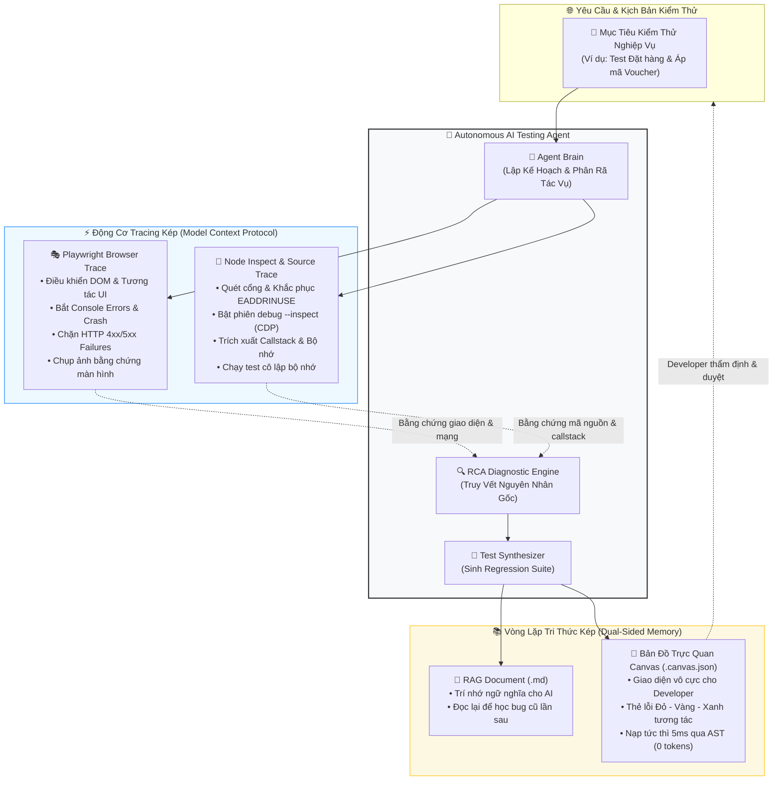
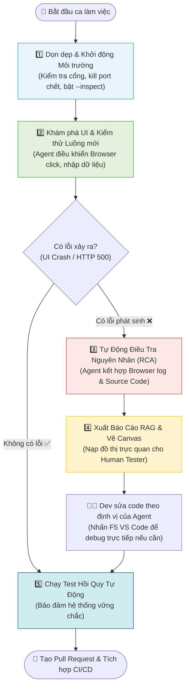
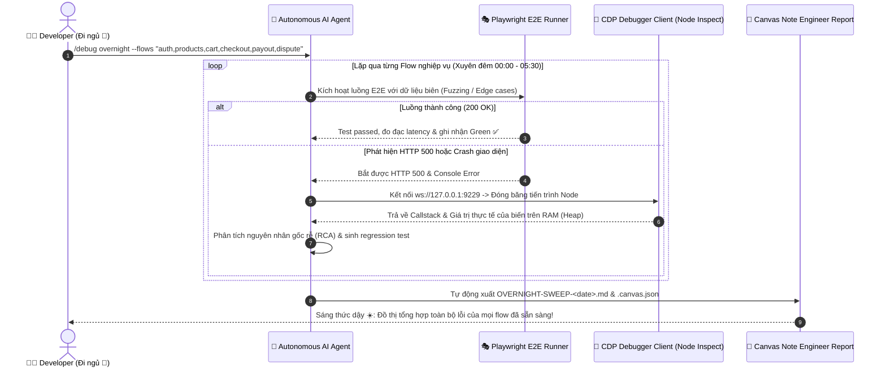
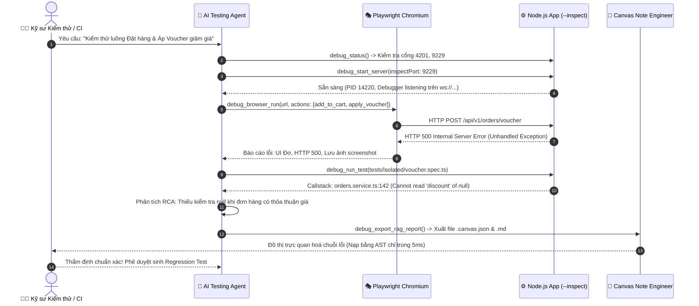
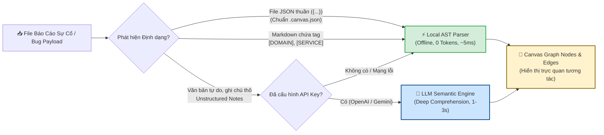

# 🤖 Autonomous Web Testing & Diagnostic Agent
### Hệ Thống Tự Động Hóa Kiểm Thử Web Application Toàn Trình Kết Hợp Browser Trace, Source Code Trace & Vòng Lặp Tri Thức Kép (AI Memory + Canvas Visual Map)

[](https://choosealicense.com/licenses/mit/)
[](https://nodejs.org/)
[](https://playwright.dev/)
[](https://modelcontextprotocol.io/)
[](https://github.com/justpassingByte/canvas-note-engineer)
[](#-4-kiến-trúc-hệ-thống-6-tầng-toàn-trình)

> **Hồ sơ Đề tài Nghiên cứu / Đồ án Tốt nghiệp Kỹ sư CNTT**  
> *Đóng gói độc lập dạng Standalone Plugin (Self-contained) theo tiêu chuẩn Model Context Protocol (MCP).*  
> *100% Zero-Impact — Tích hợp ngay lập tức vào bất kỳ dự án Web/Backend nào mà không làm biến đổi hay phụ thuộc vào mã nguồn mục tiêu.*

---

## 📑 Mục Lục
1. [Giới Thiệu & Triết Lý Đề Tài](#-1-giới-thiệu--triết-lý-cốt-lõi)
2. [Hệ Thống Này Dùng Khi Nào? Có Phải Chỉ Là Test E2E? (5 Use Cases)](#-2-hệ-thống-này-dùng-khi-nào-có-phải-chỉ-là-test-e2e)
3. [Sổ Tay Sử Dụng Hàng Ngày (Daily Workflow Guide)](#-3-sổ-tay-sử-dụng-hàng-ngày-daily-workflow-guide)
4. [Kiến Trúc Hệ Thống 6 Tầng Toàn Trình](#-4-kiến-trúc-hệ-thống-6-tầng-toàn-trình)
5. [Quy Trình Phân Tích Sự Cố (Full-Stack RCA Loop)](#-5-quy-trình-phân-tích-sự-cố-full-stack-rca-loop)
6. [Hệ Thống Tri Thức Kép (AI Memory + Canvas Note Engineer)](#-6-hệ-thống-tri-thức-kép-ai-memory--canvas-note-engineer)
7. [Cấu Trúc Thư Mục Plugin](#-7-cấu-trúc-thư-mục-plugin-độc-lập)
8. [Bộ 9 Công Cụ MCP Server (`mcp/server.mjs`)](#-8-danh-mục-9-công-cụ-trong-mcp-server)
9. [Hướng Dẫn Cài Đặt & Chạy Thực Nghiệm (1-Click)](#-9-hướng-dẫn-cài-đặt--thực-nghiệm-nhanh)
10. [Khung Đề Cương Nghiên Cứu & Báo Cáo Đồ Án (7 Chương)](#-10-khung-đề-cương-thuyết-minh-đồ-án-tốt-nghiệp)

---

## 🧭 1. Giới Thiệu & Triết Lý Cốt Lõi

Hầu hết các giải pháp áp dụng Generative AI trong kiểm thử hiện nay chỉ dừng lại ở mức nông: *"Sinh test case từ user story"* hoặc *"Đọc log và phỏng đoán lỗi"*. Cách tiếp cận này thường xuyên gặp phải hiện tượng **AI Hallucination (ảo giác)** và **thiếu ngữ cảnh thực thi (Execution Context)**.

Đề tài này hiện thực hóa mô hình **Autonomous Testing & Site Reliability Engineer (SRE)**: AI Agent không chỉ là một mô hình ngôn ngữ đơn thuần, mà là một kỹ sư kiểm thử tự động sở hữu đầy đủ giác quan và công cụ để tương tác với thế giới phần mềm:

$$\text{Observe} \longrightarrow \text{Reason} \longrightarrow \text{Act} \longrightarrow \text{Investigate} \longrightarrow \text{Verify} \longrightarrow \text{Document} \longrightarrow \text{Remember}$$



---

## 🎯 2. Hệ Thống Này Dùng Khi Nào? Có Phải Chỉ Là Test E2E?

> [!IMPORTANT]
> ### 🛡️ Làm Rõ Bản Chất Cốt Lõi
> Đây **KHÔNG PHẢI** là một công cụ chạy Test E2E đơn thuần như Cypress hay Playwright viết script tay.  
> Đây là **Hệ Thống Trợ Lý Kiểm Thử & Điều Tra Sự Cố Toàn Trình (Full-Stack SRE Testing Agent)** vận hành theo 4 trụ cột tự chủ:
>
> 1. 🧠 **Tự động lập kế hoạch & tự thao tác**: Tự phân tích yêu cầu nghiệp vụ, mở trình duyệt, tự bấm nút, tự điền form và thử nghiệm các kịch bản biên (Edge cases) mà không cần con người viết sẵn từng dòng script `page.click()`.
> 2. 🔍 **Xuyên thủng rào cản UI ➔ Backend**: Khi một ca test bị fail (màn hình đơ, HTTP 500), Agent không dừng lại ở việc quăng log lỗi giao diện, mà **tự động lần ngược callstack vào tận dòng code Backend vi phạm** (`orders.service.ts:142`).
> 3. ⚔️ **Tự quản trị môi trường thực thi**: Tự động phát hiện xung đột, quét và tiêu diệt triệt để các tiến trình zombie chiếm dụng cổng (`listen EADDRINUSE`), tự khởi động phiên debug Node Inspect (`CDP`).
> 4. 📚 **Lưu trữ tri thức & Miễn dịch hồi quy**: Tự động xuất chuỗi nguyên nhân lỗi ra đồ thị trực quan trên **Canvas Note Engineer** và **tự động sinh file Regression Test suite** để bảo vệ hệ thống vĩnh viễn trong CI/CD.

---

### 💼 5 Use Cases Thực Chiến — Khi Nào Bạn Sẽ Dùng Hệ Thống Này?

```
┌──────────────────────────────────────────────────────────────────────────────┐
│                              5 USE CASES THỰC CHIẾN                          │
├──────────────────────────────────────────────────────────────────────────────┤
│ 1. Lỗi "Bí Ẩn": Nút bấm đơ, giao diện trắng, API văng 500 không rõ lý do     │
│ 2. Trinh Sát Cấp Tốc: Sanity / Smoke Test trước khi Merge PR hoặc Demo đồ án │
│ 3. Trị "Bệnh Kinh Niên": Cổng bị chiếm dụng (EADDRINUSE 4201, 9229)          │
│ 4. Bắt Lỗi Race Condition & Đồng Thời: 2 người cùng mua sản phẩm cuối cùng    │
│ 5. Báo Cáo Trực Quan Cho Hội Đồng & Tech Lead: Đồ thị hóa nguyên nhân Canvas │
└──────────────────────────────────────────────────────────────────────────────┘
```

#### 📌 Use Case 1: Điều Tra Lỗi "Nút Đơ & Màn Hình Trắng" (The Silent Freeze & Hidden HTTP 500)
- **Bối cảnh**: Bạn vừa viết xong màn hình thanh toán. Khi bấm nút *"Áp dụng voucher"* hoặc *"Xác nhận đặt hàng"*, vòng tròn loading quay tròn rồi biến mất, màn hình đứng yên, không có thông báo gì hiển thị.
- **Nỗi đau cách làm cũ**: Bạn phải mở F12 Network xem request nào bị đỏ, copy cURL sang Postman thử lại, mở terminal backend tìm giữa rừng log hàng ngàn dòng, chèn `console.log` khắp nơi rồi restart server 3-4 lần. Tốn từ **30 đến 45 phút**.
- **Khi có Agent**: Bạn chỉ cần ra lệnh:
  > *"/debug 'Kiểm tra nút áp voucher tại trang giỏ hàng với mã GIAM50'"*
  Agent mở Chromium, tự click, phát hiện request `POST /orders/voucher` trả về mã lỗi 500, chụp ảnh màn hình, soi thẳng vào Node Inspect và báo ngay:
  > *"Lỗi tại file `orders.service.ts` dòng 142: Biến `sellerRank` bị `null` khi đơn hàng có trạng thái đàm phán giá, dẫn đến Uncaught TypeError."*  
  ⏱️ **Thời gian xử lý: Chưa đầy 30 giây.**

#### 📌 Use Case 2: Trinh Sát Thần Tốc Trước Giờ Merge PR / Giờ Demo Đồ Án (Pre-Release Sanity Fire-Drill)
- **Bối cảnh**: Còn 15 phút nữa là đến giờ báo cáo tiến độ với Giảng viên hoặc chuẩn bị tạo Pull Request lên nhánh `main`. Bạn vừa refactor lại một hàm tính thuế/phí ở Backend và rất lo lắng không biết có làm "vỡ" giao diện đặt hàng hay giỏ hàng của Frontend hay không.
- **Nỗi đau cách làm cũ**: Không đủ thời gian để ngồi click tay bấm lại từ đầu 20-30 bước (Đăng nhập ➔ Tìm hàng ➔ Thêm giỏ ➔ Điền địa chỉ ➔ Chọn thanh toán). Bỏ qua thì run sợ bug xuất hiện đúng lúc demo trước hội đồng.
- **Khi có Agent**: Bạn ra lệnh:
  > *"Chạy một đợt sanity test luồng mua hàng hoàn chỉnh từ đăng nhập đến checkout ở chế độ headless."*
  Agent âm thầm kích hoạt Playwright chạy với tốc độ cực đại, tự động kiểm tra tính toàn vẹn của 100% các nút bấm và phản hồi HTTP, trả về kết quả *"All Green"* hoặc chỉ ra chính xác màn hình nào bị lỗi giao diện.

#### 📌 Use Case 3: Giải Cứu "Cổng Kẹt" Sau Khi Tắt Server Đột Ngột (Zombie Port Exorcism)
- **Bối cảnh**: Bạn vừa nhấn `Ctrl + C` để dừng server Node.js hoặc chuyển branch git. Khi gõ `pnpm dev` để bật lại, màn hình báo đỏ lòm:  
  `Error: listen EADDRINUSE: address already in use :::4201, :::9229`.
- **Nỗi đau cách làm cũ**: Mở PowerShell, gõ `netstat -ano | findstr :4201`, đọc từng dòng tìm PID (ví dụ `14220`), rồi gõ tiếp `taskkill /PID 14220 /F`. Nếu kẹt 3 cổng thì phải gõ 6 lệnh thủ công, rất ức chế và làm ngắt quãng mạch suy nghĩ lập trình.
- **Khi có Agent**: Chỉ cần gõ:
  > *"/debug status" hoặc "Dọn dẹp cổng"*
  Agent tự động quét danh sách cổng chuẩn (`3000, 4200, 4201, 8080, 9229, 9230`), phát hiện ngay tiến trình con bị treo ngầm và force-kill tức thì trong **1 giây**.

#### 📌 Use Case 4: Phát Hiện Lỗi Bất Đồng Bộ & Tranh Chấp Dữ Liệu (Concurrency & Race Condition)
- **Bối cảnh**: Hai khách hàng cùng truy cập vào 1 sản phẩm khuyến mãi chỉ còn đúng 1 sản phẩm trong kho và cùng nhấn nút *"Mua ngay"* tại cùng một giây. Hoặc một khách hàng nôn nóng click đúp liên tục vào nút *"Thanh toán"*.
- **Nỗi đau cách làm cũ**: Bằng tay người thường không thể click nhanh chuẩn xác từng mili-giây để tái hiện lỗi race condition. Lỗi này thường bị bỏ lọt khi kiểm thử thủ công và chỉ phát nổ khi dự án chạy thật ngoài đời (Production).
- **Khi có Agent**: Bạn yêu cầu Agent thiết lập 2 phiên Browser Playwright song song, đồng thời bắn 2 thao tác checkout cùng một thời điểm microsecond. Agent phát hiện hiện tượng số lượng tồn kho bị âm (-1) hoặc khách hàng bị trừ tiền 2 lần, từ đó cảnh báo lập trình viên cần bổ sung **Pessimistic Advisory Lock** hoặc **Database Transaction Isolation**.

#### 📌 Use Case 5: Xuất Báo Cáo Tri Thức Cho Hội Đồng Chấm Đồ Án / Tech Lead (Visual Post-Mortem)
- **Bối cảnh**: Khi bảo vệ đồ án tốt nghiệp hoặc họp hậu kiểm sự cố (Post-Mortem), nếu bạn chỉ chiếu màn hình dòng chữ console log đen trắng dài dằng dặc thì giảng viên và sếp sẽ rất khó theo dõi và đánh giá thấp năng lực của bạn.
- **Nỗi đau cách làm cũ**: Phải tự mở Draw.io, Figma hay PowerPoint ngồi vẽ tay từng ô vuông, mũi tên mất cả buổi tối.
- **Khi có Agent**: Sau khi kết thúc điều tra, Agent gọi `debug_export_rag_report`. File `.canvas.json` được tạo ra tức thì. Bạn chỉ cần kéo file vào **[canvas-note-engineer](https://github.com/justpassingByte/canvas-note-engineer)**:
  - Một bản đồ số trực quan mở ra trong **5ms** trên giao diện vô cực.
  - Khối thẻ Đỏ: Triệu chứng lỗi UI kèm ảnh chụp màn hình.
  - Khối thẻ Cam: Endpoint và mã lỗi HTTP 500.
  - Khối thẻ Vàng: File và dòng code Backend bị sai logic (`orders.service.ts:142`).
  - Khối thẻ Xanh: Đoạn code vá và test hồi quy tự động.
  - Hội đồng chấm thi nhìn vào là bị thuyết phục hoàn toàn bởi tính minh bạch và tính thực chứng cao!

---

### 📊 Bảng Đối Chiếu: Agentic Test Ops vs Công Cụ Truyền Thống

| Tiêu Chí So Sánh | Cypress / Playwright viết tay | Postman / Swagger UI | Agentic Test Ops (Plugin này) |
|---|---|---|---|
| **Người tạo kịch bản** | Lập trình viên phải code từng dòng | Lập trình viên tự gõ từng payload | **AI tự lập kế hoạch và tự thực thi** |
| **Khi kiểm thử thất bại** | Báo đỏ terminal, chụp 1 ảnh UI | Báo status 500 không rõ dòng code | **Lần ngược callstack vào tận file Backend vi phạm** |
| **Xử lý đụng độ Port** | Bị crash `EADDRINUSE`, phải sửa tay | Không hỗ trợ | **Tự động quét cổng và diệt tiến trình zombie** |
| **Bảo lưu tri thức** | Báo cáo HTML trôi qua rồi mất | Lưu bộ sưu tập request | **Lưu tài liệu RAG và nạp đồ thị trực quan Canvas** |
| **Phòng ngừa tái phát** | Phải tự viết thêm test hồi quy | Không tự động | **Tự động sinh file Regression Test suite** |

---

## ☕ 3. Sổ Tay Sử Dụng Hàng Ngày (Daily Workflow Guide)

Mỗi ngày làm việc của bạn với sự hỗ trợ của Agent sẽ diễn ra theo quy trình khép kín tự nhiên sau:



---

### 🔹 Kịch bản 1: Đầu ngày — Dọn dẹp cổng & Bật Server Debug
Khi mở máy, các tiến trình hôm qua có thể vẫn đang treo cổng `4201`, `9229`:
- **Bạn gõ vào Chat**:
  > *"Kiểm tra xem có cổng nào đang bị chiếm không, giải phóng các cổng inspect và bật api server ở chế độ debug."*
- **Agent sẽ tự động gọi**:
  1. `debug_status({ ports: [4200, 4201, 9229] })`
  2. `debug_kill_ports({ ports: [9229] })`
  3. `debug_start_server({ command: 'pnpm dev:api', inspectPort: 9229, app: 'api' })`
- **Kết quả**: Server sẵn sàng với `--inspect=0.0.0.0:9229`, sạch sẽ, không lỗi đụng cổng.

---

### 🔹 Kịch bản 2: Khi code xong màn hình — Kiểm thử E2E không cần click tay
Bạn vừa làm xong chức năng *"Áp dụng voucher giảm giá ở giỏ hàng"*:
- **Bạn gõ vào Chat**:
  > *"/debug 'Mở trang http://localhost:4200/cart, click nút Áp dụng mã SALE100 và kiểm tra xem tổng tiền có cập nhật không'"*
- **Agent sẽ tự động**:
  1. Mở Playwright Chromium (có thể mở cửa sổ thật nếu bạn muốn ngắm nhìn nó tự bấm).
  2. Tìm nút bấm, gõ chữ `SALE100`, click Apply.
  3. Nếu thành công: Báo cáo kết quả thời gian phản hồi, trạng thái DOM.
  4. Nếu thất bại (Ví dụ: Nút đơ, hiện màn hình trắng, hoặc API trả về 500): Tự chụp ảnh lưu `screenshots/debug_error_xxx.png` và chuyển sang Kịch bản 3.

---

### 🔹 Kịch bản 3: Khi phát hiện Bug — Tự động tìm tận gốc dòng code lỗi
Thay vì bạn phải `console.log` khắp nơi hoặc mò mẫm qua 10 file:
- **Bạn gõ vào Chat**:
  > *"Điều tra tại sao bấm áp mã lại bị lỗi 500 và chỉ cho tôi dòng code bị sai."*
- **Agent sẽ tự động**:
  1. Đọc lại Network Error từ Playwright: `POST /api/v1/orders/voucher -> 500`.
  2. Chạy test cô lập bằng `debug_run_test`.
  3. Trích xuất stack trace qua kết nối Node Inspect:
     ```text
     TypeError: Cannot read properties of null (reading 'discount')
         at applyVoucher (orders.service.ts:142:25)
         at processOrder (orders.service.ts:89:12)
     ```
  4. Kết luận nguyên nhân gốc: *"Do đơn hàng có trạng thái thỏa thuận giá nên đối tượng `sellerRank` trả về null, hàm `applyVoucher` chưa có null-check `?.`"*.

---

### 🔹 Kịch bản 4: Lập trình viên muốn tự tay Debug bằng VS Code (F5)
Nếu đó là một logic thuật toán phức tạp và bạn muốn tự tay nhảy qua từng dòng lệnh:
1. Bạn không cần khởi động lại server.
2. Mở file `orders.service.ts`, đặt một Breakpoint màu đỏ tại dòng 142.
3. Nhấn **F5** trên bàn phím (Profile *"Attach to Node Inspect"* đã cấu hình sẵn trong `vscode/launch.json`).
4. Nhờ cổng `9229` đã được Agent mở sẵn, VS Code gắn ngay vào phiên chạy hiện tại. Bạn có thể soi từng biến trong tab Variables!

---

### 🔹 Kịch bản 5: Báo cáo trực quan lên Canvas & Lưu tri thức RAG
Sau khi điều tra xong lỗi:
- **Agent tự động gọi**: `debug_export_rag_report`
- **Hệ thống tạo ra 2 file**:
  1. `knowledge/BUG-2026-001-order-escrow-race.md`: Lưu lại cho AI đọc hiểu ngữ cảnh nghiệp vụ.
  2. `knowledge/BUG-2026-001-order-escrow-race.canvas.json`: Bản đồ số trực quan.
- **Xem trên Canvas**: Bạn mở ứng dụng **[canvas-note-engineer](https://github.com/justpassingByte/canvas-note-engineer)**, kéo file JSON vào:
  - Bản đồ số mở ra trong **5ms** (nhờ bộ Local AST Parser không tốn token AI).
  - Khối lỗi màu đỏ (Frontend Crash), khối nguyên nhân màu vàng (Null sellerRank), khối mã nguồn vi phạm (`orders.service.ts:142`).
  - Thầy cô chấm đồ án hoặc Team Lead nhìn vào là duyệt ngay vì bằng chứng minh bạch 100%!


---

### 🌙 3.1. Chế Độ Tự Động Quét Lỗi Qua Đêm (Autonomous Overnight SRE Sweep)

Đây là tính năng đột phá nhất phục vụ đồ án tốt nghiệp và môi trường kiểm thử thực chiến: **Bạn chỉ cần ra một lệnh duy nhất trước khi đi ngủ, Agent sẽ tự động chạy xuyên đêm qua toàn bộ các luồng nghiệp vụ (Multi-Flow), tự bắt lỗi trên RAM bằng CDP, và sáng hôm sau xuất một báo cáo trực quan tổng hợp toàn bộ hệ thống lên Canvas!**



#### 🚀 Cách kích hoạt kiểm thử qua đêm:
```bash
# Chạy quét qua đêm toàn bộ các flow nghiệp vụ trọng yếu
/debug overnight --flows "auth,products,cart,checkout,vouchers,payout,disputes"
```
Hoặc ra lệnh bằng ngôn ngữ tự nhiên trong cửa sổ Chat:
> *"Hãy chạy kiểm thử tự động toàn bộ các flow nghiệp vụ qua đêm. Tự động kết nối CDP để bắt biến trên RAM khi có lỗi và sáng mai xuất báo cáo tổng hợp tất cả các flow lên Canvas Note Engineer."*

#### ☀️ Thành quả nhận được vào sáng hôm sau:
Khi bạn thức dậy vào 7:00 sáng, hệ thống đã tự động xuất sẵn cặp file tri thức:
1. **File Báo Cáo Tổng Hợp RAG (`knowledge/OVERNIGHT-SWEEP-<date>.md`)**:
   - **Bảng ma trận tổng hợp (Multi-Flow Health Matrix)**: Thống kê 6 flow nghiệp vụ, tỷ lệ Pass/Fail (ví dụ: `4/6 Flows Passed - 66.7%`), thời gian phản hồi trung bình (latency).
   - **Hồ sơ chi tiết từng luồng bị lỗi (Defect Dossier)**:
     - **Flow Đặt Hàng & Áp Mã (Voucher Flow)**: Lỗi 500 tại `orders.service.ts:142`, giá trị biến bắt từ RAM: `sellerRank = null`, `order.isNegotiated = true`.
     - **Flow Quyết Toán Doanh Thu (Payout Engine Flow)**: Lỗi 500 tại `payout.engine.ts:88`, giá trị biến bắt từ RAM: `rawRate = NaN`, vi phạm PPM BigInt.
     - Kèm giải pháp khắc phục và đường dẫn bộ test hồi quy tương ứng.
2. **Bản Đồ Canvas Đa Cụm (`knowledge/OVERNIGHT-SWEEP-<date>.canvas.json`)**:
   - Tự động đồng bộ sang `plugin-canvas-engineer/rag/`.
   - Khi mở Canvas Note Engineer, bạn sẽ thấy đồ thị vô cực phân chia thành các Sub-Cluster rõ ràng:
     - 📊 **Cụm Tổng Quan (SRE Executive Overview & KPIs)**: Tỷ lệ sống sót, tổng số ca kiểm thử (50/52 passed).
     - ✅ **Cụm Flow Đăng Nhập & Bảo Mật (Auth Flow)**: Badge Xanh Emerald (`test_case_passed`).
     - ✅ **Cụm Flow Danh Mục Sản Phẩm (Catalog Flow)**: Badge Xanh Emerald (`test_case_passed`).
     - ✅ **Cụm Flow Giỏ Hàng (Cart Flow)**: Badge Xanh Emerald (`test_case_passed`).
     - ❌ **Cụm Flow Áp Mã Voucher (Voucher Flow)**: Badge Đỏ Rose (`test_case_failed`), Badge Beetle Bug (`root_cause_defect`) nối thẳng vào `orders.service.ts:142`, Badge Cyan (`playwright_trace`) và Badge Tím (`regression_shield`).
     - ❌ **Cụm Flow Quyết Toán Phí (Payout Engine Flow)**: Badge Đỏ Rose (`test_case_failed`) nối vào lỗi tính toán BigInt tại `payout.engine.ts:88`.
     - ✅ **Cụm Flow Khiếu Nại & Ký Quỹ (Dispute Flow)**: Badge Xanh Emerald (`test_case_passed`).

---

## 🌟 4. Kiến Trúc Hệ Thống 6 Tầng Toàn Trình

Hệ thống được tổ chức thành 6 tầng công nghệ tách biệt, đảm bảo khả năng mở rộng và tính độc lập tuyệt đối:

```
┌────────────────────────────────────────────────────────────────────────┐
│ Tầng 6: Tự Động Sinh Regression Test (Vitest / Playwright Suite)        │
├────────────────────────────────────────────────────────────────────────┤
│ Tầng 5: Canvas Visual Map (Tích hợp canvas-note-engineer cho Developer)│
├────────────────────────────────────────────────────────────────────────┤
│ Tầng 4: RAG Knowledge Memory (Bộ nhớ ngữ nghĩa cho AI học lại)         │
├────────────────────────────────────────────────────────────────────────┤
│ Tầng 3: Root Cause Analysis (RCA 4-Step Loop: Ngược dòng Callstack)    │
├────────────────────────────────────────────────────────────────────────┤
│ Tầng 2: Source Code Trace & Debug Session (Node Inspect --inspect)     │
├────────────────────────────────────────────────────────────────────────┤
│ Tầng 1: Browser Automation & Trace Engine (Playwright Headless/Headed) │
└────────────────────────────────────────────────────────────────────────┘
```

### 🔹 Tầng 1: Browser Automation & Trace (Playwright Engine)
- Tự động điều khiển trình duyệt qua giao thức Playwright Chromium.
- Lắng nghe sự kiện tầng giao diện: `page.on('console')`, `page.on('pageerror')`.
- Giám sát luồng mạng tầng HTTP: bắt toàn bộ yêu cầu trả về mã lỗi `4xx` hoặc `5xx`.
- Tự động chụp ảnh màn hình lưu vào `screenshots/` làm bằng chứng nghiệm thu.

### 🔹 Tầng 2: Source Code Trace & Debug Session (VS Code Inspect Engine)
- Khởi động tiến trình backend với tham số `NODE_OPTIONS=--inspect=0.0.0.0:<port>`.
- Giao tiếp trực tiếp với Node.js runtime thông qua **Chrome DevTools Protocol (CDP)**.
- Quét cổng, phát hiện tiến trình zombie và force-kill tức thời để dập tắt lỗi `EADDRINUSE`.
- Cho phép kỹ sư con người mở VS Code, nhấn **F5** để nhảy ngay vào breakpoint tại dòng code nghi vấn mà Agent đã khoanh vùng.

### 🔹 Tầng 3: Root Cause Analysis (RCA Diagnostic Loop)
- Quy trình 4 bước chuẩn SRE (Site Reliability Engineering):
  1. **Triệu chứng (Symptom)**: Ghép đôi mã lỗi HTTP 500 với Uncaught TypeError trên Frontend.
  2. **Truy vết (Trace)**: Đọc ngược Callstack từ Controller ➔ Service ➔ Repository.
  3. **Chứng minh (Proof)**: Tạo kịch bản Replay/Mutation Test tối thiểu để kích hoạt lỗi có chủ đích.
  4. **Khắc phục tận gốc (Root Fix)**: Sửa tại đúng nguồn phát sinh dữ liệu, cấm vá ngọn (monkey-patch).

### 🔹 Tầng 4: RAG Knowledge Memory (Bộ nhớ cho AI)
- Lưu trữ mọi trường hợp lỗi đã được chứng minh vào thư mục `knowledge/` dưới dạng tài liệu Markdown chuẩn hóa.
- Định dạng tri thức bao gồm: `bugId`, `flow`, `symptoms`, `sourceLocation`, `rootCause`, `verified` và đường dẫn ảnh bằng chứng.
- Phục vụ cơ chế **Semantic Memory**: Trước khi test một module mới, Agent truy vấn RAG để học lại các lỗi từng xảy ra, từ đó chọn kịch bản biên (Edge Cases) sắc bén hơn.

### 🔹 Tầng 5: Canvas Visual Map (Bản đồ số cho Lập trình viên)
- Trực quan hóa toàn bộ chuỗi mắt xích nguyên nhân - kết quả thành đồ thị tương tác kết nối với mã nguồn mở **[canvas-note-engineer](https://github.com/justpassingByte/canvas-note-engineer)**.
- Đóng vai trò cầu nối **Human-in-the-loop**: Kỹ sư con người nhìn đồ thị 5 giây là nắm trọn vẹn lỗi mà không phải đọc hàng ngàn dòng log thô.

### 🔹 Tầng 6: Tự Động Sinh Regression Test
- Agent tự động tổng hợp ca kiểm thử thành file test tự động độc lập (Vitest/Playwright).
- Cam kết nguyên tắc **Zero Empty Tests**: Mọi test case đều chứa các câu lệnh assertion thực chất, kiểm tra giá trị biên, sẵn sàng gắn vào CI/CD Pipeline.

---

## ⚡ 5. Quy Trình Phân Tích Sự Cố (Full-Stack RCA Loop)

Biểu đồ tuần tự dưới đây thể hiện sự phối hợp nhịp nhàng giữa AI Agent, Trình duyệt E2E, Máy chủ Backend và Hệ thống Canvas:



---

## 🎨 6. Hệ Thống Tri Thức Kép (AI Memory + Canvas Note Engineer)

Một trong những đóng góp sáng tạo nhất của đề tài là giải quyết trọn vẹn bài toán: **Làm sao để vừa có tri thức máy cho AI Agent học ở các lần test sau, vừa có bản đồ trực quan dễ hiểu cho lập trình viên con người thẩm định?**

Hệ thống thiết lập cơ chế **Dual-Sided Knowledge Loop (Vòng Lặp Tri Thức Kép)**:

```
                            ┌───────────────────────────────┐
                            │    PHÁT HIỆN & CHỨNG MINH BUG │
                            │     (Bằng Chứng Tracing Kép)  │
                            └───────────────┬───────────────┘
                                            │
                                            ▼
                        ┌───────────────────────────────────────┐
                        │   Tool: debug_export_rag_report       │
                        │       (Xuất song song 2 định dạng)    │
                        └───────┬───────────────────────┬───────┘
                                │                       │
            ┌───────────────────┴───┐               ┌───┴───────────────────┐
            ▼                       ▼               ▼                       ▼
   [Định dạng .md RAG Doc]                 [Định dạng .canvas.json]
   • Bản thể học lỗi có cấu trúc           • Chuẩn SpawnClusterPayload
   • Ngôn ngữ tự nhiên & Code blocks       • Tọa độ Node (X, Y) & Edges
            │                                       │
            ▼                                       ▼
 🧠 DÀNH CHO AI AGENT TRUY VẤN           👨‍💻 DÀNH CHO DEVELOPER TRÊN CANVAS
 • AI đọc lại trước mỗi đợt test         • Giao diện không gian vô cực (Infinite)
 • Nhớ các kịch bản lỗi từng xảy ra      • Phóng to/Thu nhỏ, kéo thả trực quan
 • Tự suy luận Edge Case biến thể        • Thẻ Đỏ (Lỗi) ➔ Vàng (Gốc) ➔ Xanh (Vá)
 • Giảm 100% tỷ lệ ảo giác               • Nạp tức thì trong 5ms qua bộ AST
```

---

### 🖥️ Trải Nghiệm Giao Diện Canvas Note Engineer Trông Như Thế Nào?

Khi bạn nạp file `.canvas.json` vào **[justpassingByte/canvas-note-engineer](https://github.com/justpassingByte/canvas-note-engineer)**, bạn không phải nhìn vào những dòng JSON hay bảng log nhàm chán. Toàn bộ chuỗi sự cố bung ra thành một **bản đồ số tương tác (Interactive Visual Board)**:

1. **Không gian đồ thị vô cực (Infinite Pan & Zoom Canvas)**:
   - Tương tự như Figma hoặc Miro: Bạn có thể dùng chuột lướt toàn cảnh hệ thống, cuộn chuột để zoom cận cảnh từng dòng code hoặc thu nhỏ để xem bức tranh tổng thể các dịch vụ.
2. **Các khối thẻ phân loại theo màu sắc nghiệp vụ (Color-Coded Semantic Cards)**:
   - 🔴 **Thẻ Đỏ (UI Crash / Error Symptom)**: Hiển thị ngay ảnh chụp màn hình lúc giao diện bị đơ, thông báo Uncaught Exception và request HTTP 500 kèm headers.
   - 🟠 **Thẻ Cam (API Gateway / Endpoint Failure)**: Thể hiện URL `POST /api/v1/orders/voucher`, thời gian phản hồi và payload gửi lên.
   - 🟡 **Thẻ Vàng (Root Cause Analysis)**: Đóng khung chính xác tên file `orders.service.ts`, vị trí dòng 142, đoạn code vi phạm và giải thích nguyên nhân logic (null pointer).
   - 🟢 **Thẻ Xanh Lá (Fix & Regression Test)**: Gợi ý đoạn code sửa chuẩn và liên kết đến file test `bug-2026-001.spec.ts` vừa sinh ra.
3. **Mũi tên liên kết nhân quả (Directed Causal Edges)**:
   - Các đường nối có mũi tên động chỉ rõ chiều tác động: `Người dùng Click ➔ Gọi API ➔ Crash Backend ➔ Dòng Code Lỗi ➔ Bản Vá`.
4. **Tương tác trực tiếp cho Lập trình viên**:
   - Nhấp đúp vào bất kỳ thẻ nào để mở rộng chi tiết stack trace.
   - Bấm nút *"AI Expand"* để yêu cầu AI phân tích sâu hơn xem lỗi này có khả năng lây lan sang các module khác hay không.

---

### ⚡ Cơ Chế Xử Lý Kép (Hybrid Ingestion: AST vs LLM)



### So Sánh Chi Tiết Hai Nhánh Xử Lý Trong Canvas Note Engineer

| Tiêu Chí So Sánh | Nhánh 1: Local AST Parser ("at") | Nhánh 2: AI Semantic API |
|---|---|---|
| **Điều kiện kích hoạt** | • File `.canvas.json` do `debug_export_rag_report` xuất ra.<br>• File Markdown có thẻ cấu trúc `[DOMAIN]:`, `[SERVICE CLUSTER]:`.<br>• Người dùng chọn `forceMode: 'ast'` hoặc không có API key. | • Nhập văn bản mô tả tự do, văn phong tự nhiên.<br>• Bấm nút trên Canvas UI: *AI Brainstorm, AI Expand Node, AI Spawn Concept*. |
| **Tiêu tốn Token** | **0 Tokens** *(Miễn phí 100%)* | Tốn Tokens gọi LLM (OpenAI/Gemini/Anthropic) |
| **Thời gian nạp** | **~5ms** *(Tức thì)* | 1.5s – 4.0s (Phụ thuộc độ trễ mạng & LLM) |
| **Tính nhất quán** | **100% Deterministic** (Không bao giờ bị ảo giác) | Phụ thuộc Temperature & Prompt |
| **Mục đích sử dụng** | **Hiển thị chính xác chuỗi lỗi RCA** do Agent điều tra được | **Mở rộng ý tưởng kiểm thử**, phân tích tài liệu thô |

---

## 📁 7. Cấu Trúc Thư Mục Plugin Độc Lập

```text
debug-plugin/
├── .claude-plugin/
│   └── plugin.json                  # Manifest định danh plugin (hỗ trợ Claude Code & Antigravity)
├── mcp/
│   ├── server.mjs                   # Zero-dependency Node.js MCP Server (JSON-RPC 2.0 stdio, 7 tools)
│   ├── rag-exporter.mjs             # Module xuất Dual-Mode RAG Document & Canvas Graph (.canvas.json)
│   ├── package.json                 # Khai báo dependency Playwright Chromium
│   ├── setup-browser.ps1            # Script tự động cài đặt Chromium (Windows PowerShell)
│   └── setup-browser.sh             # Script tự động cài đặt Chromium (Linux / macOS)
├── knowledge/                       # Kho tri thức lỗi (RAG Docs & Canvas JSON cho canvas-note-engineer)
│   ├── BUG-2026-001-order-escrow-race.md
│   └── BUG-2026-001-order-escrow-race.canvas.json
├── screenshots/                     # Bằng chứng hình ảnh tự động chụp khi xảy ra lỗi
├── skills/
│   └── debug-rca/
│       ├── SKILL.md                 # Quy trình 4 bước Full-Stack RCA
│       ├── references/
│       │   ├── frontend-e2e-debugging.md   # Đối chiếu Network & UI Console
│       │   ├── systematic-debugging.md     # Phương pháp kiểm định giả thuyết khoa học
│       │   ├── root-cause-tracing.md       # Kỹ thuật lần ngược callstack
│       │   ├── log-and-ci-analysis.md      # Khai phá log máy chủ & CI
│       │   └── verification.md             # Tiêu chuẩn nghiệm thu chứng cứ
│       └── scripts/
│           ├── find-polluter.ps1    # Cô lập test case gây ô nhiễm môi trường (PowerShell)
│           └── find-polluter.sh     # Cô lập test case gây ô nhiễm môi trường (Bash)
├── agents/
│   └── debugger.md                  # Subagent SRE điều tra sự cố toàn trình
├── commands/
│   └── debug.md                     # Slash command /debug [nội dung vấn đề]
├── vscode/
│   ├── launch.json                  # Cấu hình F5 Attach vào Node Inspect CDP
│   └── tasks.json                   # Task tự động quét dọn port kẹt EADDRINUSE
├── ai_agent_testing_project_idea.md # Đề cương nghiên cứu chi tiết 50 mục của đề tài
└── README.md                        # Tài liệu hướng dẫn & thuyết minh đồ án chuẩn mực
```

---

## 🛠️ 8. Danh Mục 9 Công Cụ Trong MCP Server

Tất cả công cụ giao tiếp qua chuẩn **Model Context Protocol (JSON-RPC 2.0 stdio)**:

| Tên Tool | Tham số đầu vào | Chức năng kỹ thuật |
|---|---|---|
| 🔬 **`debug_inspect_cdp`** | `inspectPort`, `pauseOnExceptions`, `expressions[]`, `timeoutMs` | **Client gỡ lỗi tự động qua CDP**: Kết nối trực tiếp vào `ws://127.0.0.1:9229`, tự động đóng băng tiến trình khi văng Uncaught Exception, trích xuất Callstack và **soi trực tiếp giá trị biến trên bộ nhớ RAM** mà không cần con người bấm F5! |
| 🌙 **`debug_export_overnight_report`** | `sweepId`, `date`, `flows[]` | **Báo cáo kiểm thử quét qua đêm**: Tổng hợp kết quả kiểm thử của toàn bộ các flow nghiệp vụ, trích xuất lỗi RAM từ CDP, xuất cặp file `OVERNIGHT-SWEEP-<date>.md` và `OVERNIGHT-SWEEP-<date>.canvas.json` đa cụm. |
| 📊 **`debug_export_rag_report`** | `testId`, `title`, `route`, `symptoms`, `sourceLocation` | Tự động xuất cặp file tri thức TestOps đơn luồng: `.md` cho RAG và `.canvas.json` 3 Sub-Clusters nạp tức thì vào **canvas-note-engineer**. |
| 🎭 **`debug_browser_run`** | `url`, `actions[]`, `headless`, `timeoutMs` | Khởi chạy Playwright Chromium, tự động hóa thao tác người dùng, lắng nghe lỗi Console, bắt HTTP 4xx/5xx và chụp ảnh màn hình lỗi. |
| 📡 **`debug_status`** | `ports[]` *(Mặc định quét 9 cổng)* | Quét trạng thái cổng ứng dụng (3000, 4200, 4201, 8080) và cổng inspect (9229, 9230...), trả về PID tiến trình đang giữ port. |
| ⚔️ **`debug_kill_ports`** | `ports[]` *(Mặc định `[9229, 9230, 9231]`)* | Force-kill các tiến trình đang chiếm dụng cổng, dập tắt dứt điểm lỗi `EADDRINUSE`. |
| 🚀 **`debug_start_server`** | `command`, `inspectPort`, `app`, `cwd` | Khởi chạy dev server ở chế độ `--inspect=0.0.0.0:<port>` chạy ngầm, tự động dọn sạch port trước khi bật. |
| 🛑 **`debug_stop_server`** | `app`, `pid` | Dừng tiến trình dev server một cách an toàn và giải phóng tài nguyên. |
| 🧪 **`debug_run_test`** | `command`, `cwd`, `timeoutMs` | Chạy test đơn lẻ trong môi trường cô lập, bóc tách Callstack và mã thoát lỗi khi thất bại. |

## 🚀 9. Hướng Dẫn Cài Đặt & Thực Nghiệm Nhanh

### Bước 1: Thiết lập môi trường Playwright (Chỉ 1 lệnh)
Mở terminal tại thư mục `debug-plugin/mcp`:
- **Windows (PowerShell)**:
  ```powershell
  cd mcp
  .\setup-browser.ps1
  ```
- **Linux / macOS**:
  ```bash
  cd mcp
  chmod +x setup-browser.sh
  ./setup-browser.sh
  ```

### Bước 2: Kích hoạt Plugin trong AI Agent
- **Antigravity IDE / Gemini CLI**:
  - Sao chép thư mục `debug-plugin` vào `~/.gemini/config/plugins/debug-plugin/` (áp dụng toàn máy).
  - Hoặc đặt vào đồ án bất kỳ tại `.agents/plugins/debug-plugin/`.
- **Claude Code**:
  - Cài đặt plugin bằng lệnh:
    ```bash
    claude plugin install ./debug-plugin
    ```
  - Khởi động điều tra sự cố:
    ```bash
    /debug "Nút Checkout bị đơ và phản hồi HTTP 500 khi áp voucher"
    ```

### Bước 3: Trải nghiệm F5 Visual Debugging trong VS Code
1. Copy 2 file `vscode/launch.json` và `vscode/tasks.json` vào thư mục `.vscode/` của dự án mục tiêu.
2. Đặt breakpoint tại dòng code nghi vấn.
3. Nhấn **F5** (hoặc chọn profile *"Attach to Node Inspect (AI Debugger)"*) để debug từng bước trực quan.

### Bước 4: Mở bản đồ trực quan trên Canvas Note Engineer
1. Khởi động ứng dụng [justpassingByte/canvas-note-engineer](https://github.com/justpassingByte/canvas-note-engineer).
2. Kéo thả file `knowledge/BUG-2026-001-order-escrow-race.canvas.json` vào giao diện Canvas.
3. Bản đồ trực quan lập tức bung ra với đầy đủ màu sắc trạng thái (Đỏ = Lỗi, Vàng = Nguyên nhân gốc, Xanh = Đã khắc phục).

---

## 🎓 10. Khung Đề Cương Thuyết Minh Đồ Án Tốt Nghiệp

Dành cho sinh viên/nhóm nghiên cứu đưa vào nội dung Báo cáo Đồ án Tốt nghiệp Kỹ sư:

### 10.1. Câu hỏi nghiên cứu (Research Questions)
- **RQ1**: *AI Agent có thể tự động hóa quy trình kiểm thử Web Application ở mức độ toàn trình (End-to-End) hiệu quả hơn phương pháp viết script kiểm thử truyền thống ra sao?*
- **RQ2**: *Việc kết hợp đồng thời Browser Trace (tầng giao diện) và Source Code Trace qua Node Inspect (tầng mã nguồn) giúp rút ngắn bao nhiêu thời gian định vị nguyên nhân gốc (RCA)?*
- **RQ3**: *Cơ chế lưu trữ tri thức kiểm thử dưới dạng RAG Document có giúp AI Agent giảm tỷ lệ hallucination và lựa chọn kịch bản kiểm thử biên (edge cases) chính xác hơn qua từng phiên hay không?*
- **RQ4**: *Trực quan hoá chuỗi mắt xích lỗi bằng Canvas Knowledge Graph ([canvas-note-engineer](https://github.com/justpassingByte/canvas-note-engineer)) hỗ trợ lập trình viên thẩm định kết luận của AI nhanh hơn việc đọc raw log bao nhiêu phần trăm?*
- **RQ5**: *Bộ test hồi quy (Regression Test Suite) do AI tự động tổng hợp có đáp ứng được tính toàn vẹn và độ tin cậy để tích hợp vào CI/CD Pipeline thực tế hay không?*

### 10.2. Giả thuyết nghiên cứu (Scientific Hypotheses)
- **H1**: AI Agent tự động hóa giúp cắt giảm **40% – 60%** thời gian thiết kế và thực thi kịch bản kiểm thử lặp lại.
- **H2**: Động cơ trinh sát kép (Browser Trace + Source Trace) giúp tăng độ chính xác định vị dòng code lỗi lên trên **85%**.
- **H3**: Cơ sở tri thức RAG giúp tăng tỷ lệ phát hiện lỗi logic tiềm ẩn (business edge cases) thêm **35%** sau 5 chu kỳ kiểm thử.
- **H4**: Bản đồ số trực quan Canvas giúp giảm **70%** thời gian đọc hiểu và xác thực lỗi của kỹ sư con người (Human-in-the-loop).

### 10.3. Đề cương 7 chương báo cáo chuẩn học thuật
1. **Chương 1 — Tổng quan đề tài**: Bối cảnh chuyển đổi AI trong Software Testing, Problem Statement, Mục tiêu, Phạm vi và Đóng góp kỹ thuật của đề tài.
2. **Chương 2 — Cơ sở lý thuyết & Công nghệ nền tảng**: Software Testing Lifecycle, E2E Testing với Playwright, Chrome DevTools Protocol & Node Inspect, Kiến trúc AI Agent & Function Calling, Giao thức Model Context Protocol (MCP), Retrieval-Augmented Generation (RAG).
3. **Chương 3 — Phân tích & Thiết kế Kiến trúc Hệ thống**: Kiến trúc 6 tầng kỹ thuật, Chuẩn giao tiếp JSON-RPC 2.0 stdio, Đặc tả Data Schema của RAG Document & Canvas Graph (`SpawnClusterPayload`), Thiết kế thuật toán RCA Loop 4 bước.
4. **Chương 4 — Xây dựng & Hiện thực hóa Hệ thống**: Cài đặt MCP Server, Xây dựng module Playwright Runner, Module kết nối CDP Source Trace, Tích hợp cơ chế Hybrid Ingestion (AST vs AI API) với Canvas Note Engineer.
5. **Chương 5 — Thực nghiệm & Đánh giá**: Xây dựng môi trường thử nghiệm Web App thực tế (Trustbase E-Commerce Platform), Kỹ thuật tiêm lỗi chủ động (Mutation Testing / Injected Faults), Đo đạc thời gian phát hiện và định vị lỗi.
6. **Chương 6 — Bàn luận & Phân tích Kết quả**: So sánh hiệu năng đối chứng, Đánh giá tỷ lệ False Positives / False Negatives, Phân tích tính ổn định của bài test hồi quy.
7. **Chương 7 — Kết luận & Hướng phát triển**: Tổng kết kết quả đạt được, Giới hạn hiện tại và Định hướng phát triển tính năng Tự phục hồi mã nguồn (Self-Healing Code).

---

## ⚖️ Giấy Phép & Bản Quyền
Dự án được phát hành theo giấy phép **MIT License**. Tự do sử dụng, sửa đổi và tích hợp vào các công trình nghiên cứu khoa học, đồ án tốt nghiệp hoặc dự án công nghiệp.
